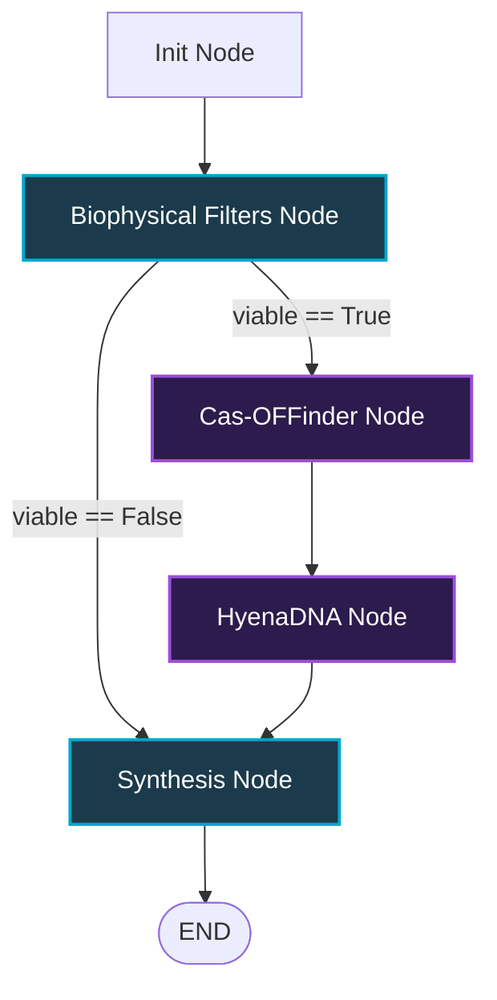

# DeepGenomic Orchestrator - System Architecture Specification

This document provides a technical specification and structural reference for the **DeepGenomic Orchestrator** architecture, detailing the multi-agent state machine, compute short-circuiting, VRAM protection mechanisms, and random-access genomic context extraction.

---

## 1. Multi-Agent Orchestrator Flow (LangGraph)

The core orchestration engine is built as an asynchronous StateGraph using LangGraph. It processes candidate CRISPR target sequences through structured nodes, managing pipeline state transitively in a unified `GraphState`.



### GraphState Schema

The pipeline state is maintained in a transitive dictionary conforming to the `GraphState` typed schema:

| State Field | Type | Description |
| :--- | :--- | :--- |
| `input_sequence` | `str` | Raw input sequence submitted by the client (short guide or long fragment). |
| `current_step` | `str` | Trace identifier indicating the active execution step. |
| `guide_sequence` | `str` | Derived 20bp target guide sequence (excluding PAM). |
| `biological_filter_result` | `dict[str, Any]` | Report containing biophysical scores and viability parameters. |
| `cas_offinder_result` | `dict[str, Any]` | Transcribed off-target alignments, coordinates, and error records. |
| `hyenadna_score` | `float` | Zero-shot efficiency score generated by the HyenaDNA model. |
| `final_evaluation` | `str` | Structured professional synthesis generated by the local LLM. |
| `metadata` | `dict[str, Any]` | Diagnostic metadata (e.g. coordinates, LLM parameters, model types). |

---

## 2. Biophysical Filters & Short-Circuit Routing

To optimize local compute cycles and prevent VRAM allocation overhead, the system enforces a strict biophysical screening layer before invoking alignment or deep learning nodes. 

### Biophysical Safety Rules

Candidates must pass the following rules, implemented natively to avoid external dependencies:

| Rule Category | Condition | Formula / Check Method | Threshold / Constraint |
| :--- | :--- | :--- | :--- |
| **GC Fraction** | Validation | `(G + C) / len(seq)` | `0.3 <= GC <= 0.7` |
| **Shannon Entropy** | Complexity | $-\sum (p_i \log_2 p_i)$ | `Entropy >= 1.5` |
| **Homopolymers** | Repeat Avoidance | Sliding window of size $N$ | No run of single nucleotide $\ge 6$ bp |
| **Poly-T Termination** | U6 Promoter Risk | Substring search | No `"TTTT"` (or `"UUUU"`) sequence |
| **Self-Complementarity** | Hairpin Avoidance | Sliding window matching reverse-complement | Max self-fold stem length $< 6$ bp |

### Short-Circuit Logic

A **Conditional Routing Edge** is evaluated immediately after the `biological_filter` node:

```python
def route_after_filter(state: GraphState) -> str:
    result = state.get("biological_filter_result")
    if result and result.get("viable") is True:
        return "cas_offinder"
    return "synthesize"
```

If a guide fails any biophysical rule (`viable == False`), the graph short-circuits directly to the `synthesize` node. This bypasses both `cas_offinder` and `hyenadna`, avoiding heavy CPU-bound subprocess spawning and GPU-bound transformer forward passes.

---

## 3. VRAM Protection & Concurrency Controls

Running heavy sequence classification models (`hyenadna-small-32k`, 107 layers) concurrently on consumer hardware (e.g. RTX 4090) presents VRAM contention risks. The system mitigates this via a dual-concurrency control pattern.

```
       FastAPI Event Loop (Async)
                 │
                 ├──► run_evaluation() [Async Node Graph]
                 │        │
                 │        └──► hyenadna_node [Awaitable]
                 │                 │
                 │                 └──► asyncio.to_thread(predict_efficiency)
                 │                          │
                 │                    [Worker Thread]
                 │                          │
                 │                          └──► with self._inference_lock:
                 │                                   │
                 │                                   └──► GPU Forward Pass
```

### 1. Thread Isolation (`asyncio.to_thread`)
Because model loading and forward passes are synchronous CPU/GPU-bound tasks, executing them directly in FastAPI's entry points would block the single-threaded event loop. All inference calls are delegated to worker threads:

```python
# tools.py
async def score_with_hyenadna(target_seq: str) -> float | None:
    evaluator = _get_hyenadna_inference()
    # Execute blocking prediction on an isolated thread
    score = await asyncio.to_thread(evaluator.predict_efficiency, target_seq)
    return score
```

### 2. GPU forward Pass Serialization (`threading.Lock`)
To protect CUDA memory allocations and serialize VRAM usage during concurrent request spikes, the model evaluator uses a double-checked locking singleton containing an execution mutex:

```python
# hyena_inference.py
class HyenaZeroShotEvaluator:
    def __init__(self):
        self._inference_lock = threading.Lock()
        
    def predict_efficiency(self, sequence: str) -> float:
        # Prevent parallel GPU forward passes from separate threads
        with self._inference_lock:
            inputs = self.tokenizer(sequence, return_tensors="pt", truncation=True, max_length=max_len)
            outputs = self.model(inputs["input_ids"].to(self.device))
            return self._decode_score(outputs)
```

---

## 4. Long-Context Genomic Injection

The system utilizes the large context window of the HyenaDNA model by injecting up to a 2kb flanking sequence around short guide candidates (1000 bp upstream and 1000 bp downstream of the cut site).

### Spatial Coordinate Resolution
When the user submits a short target sequence (< 100 bp), the system dynamically maps it to the reference genome:
1. Scan `cas_offinder_result` for the exact on-target hit, identified by `mismatches == 0`.
2. Extract the spatial coordinates: `chromosome`, `position` (0-indexed start of the 23bp protospacer+PAM target site), and `strand` orientation.
3. If no on-target hit is found, fallback to the short guide sequence.

### O(1) Byte-Offset FASTA Extraction
To extract the sequence efficiently without loading gigabytes of chromosome data into RAM, the `FastaExtractor` reads directly from files utilizing byte offsets.

#### Offset Calculation Formulas

For a chromosome starting at file byte offset $O$, with lines wrapped at sequence length $L$ and line byte width $W$ (including newlines):

Given target 0-indexed coordinate $P$:

$$\text{Line Index} = \lfloor \frac{P}{L} \rfloor$$

$$\text{Character Index in Line} = P \pmod L$$

$$\text{Start Byte} = O + (\text{Line Index} \times W) + \text{Character Index in Line}$$

Given sequence extraction length $S$, the ending position $P_{end} = P + S$:

$$\text{End Line Index} = \lfloor \frac{P_{end} - 1}{L} \rfloor$$

$$\text{End Character Index in Line} = (P_{end} - 1) \pmod L$$

$$\text{End Byte} = O + (\text{End Line Index} \times W) + \text{End Character Index in Line} + 1$$

$$\text{Bytes to Read} = \text{End Byte} - \text{Start Byte}$$

The system performs a single disk seek and read operation of size $\text{Bytes to Read}$ bytes, and then removes newline characters (`\n` and `\r`) from the buffer to reconstruct the exact genomic sequence.

### Sequence Reconstruction & Complementation
- If `strand == "+"`: The extracted window sequence is scored directly.
- If `strand == "-"`: The extracted window sequence is reverse-complemented using a zero-dependency mapping table:

```python
# fasta_extractor.py
def reverse_complement(seq: str) -> str:
    complement = {
        "A": "T", "T": "A", "C": "G", "G": "C", "N": "N",
        "a": "t", "t": "a", "c": "g", "g": "c", "n": "n"
    }
    return "".join(complement.get(base, base) for base in reversed(seq))
```
